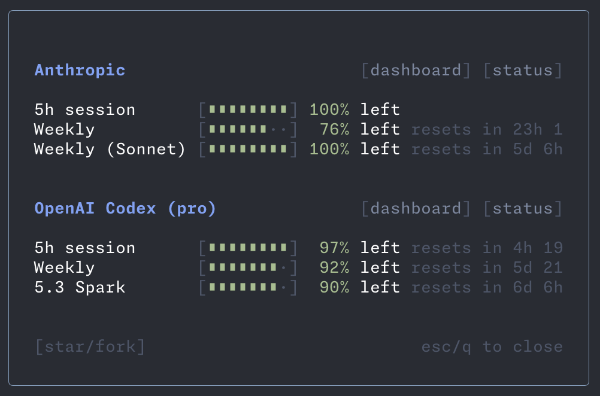

# pi-llm-usage

A small [pi](https://github.com/badlogic/pi-mono) extension that adds a `/usage` command to show LLM subscription usage in an overlay.



## Install

### Recommended (global convention)

```bash
pi install git:github.com/taviks/pi-llm-usage
```

This installs the package in pi's global location and updates global settings (`~/.pi/agent/settings.json`).

### Manual settings entry (global)

```json
{
  "packages": ["git:github.com/taviks/pi-llm-usage"]
}
```

Then run `/reload` in pi.

## Usage

```text
/usage
```

Shows usage windows for:
- Anthropic (5h / weekly / model-specific when available)
- OpenAI Codex (session / weekly)

Close with `Esc`, `Enter`, or `q`.

## Notes

- Uses your existing OAuth sessions (no API keys required)
- Reads credentials from `~/.pi/agent/auth.json` and falls back to `~/.codex/auth.json` for Codex

## License

MIT
